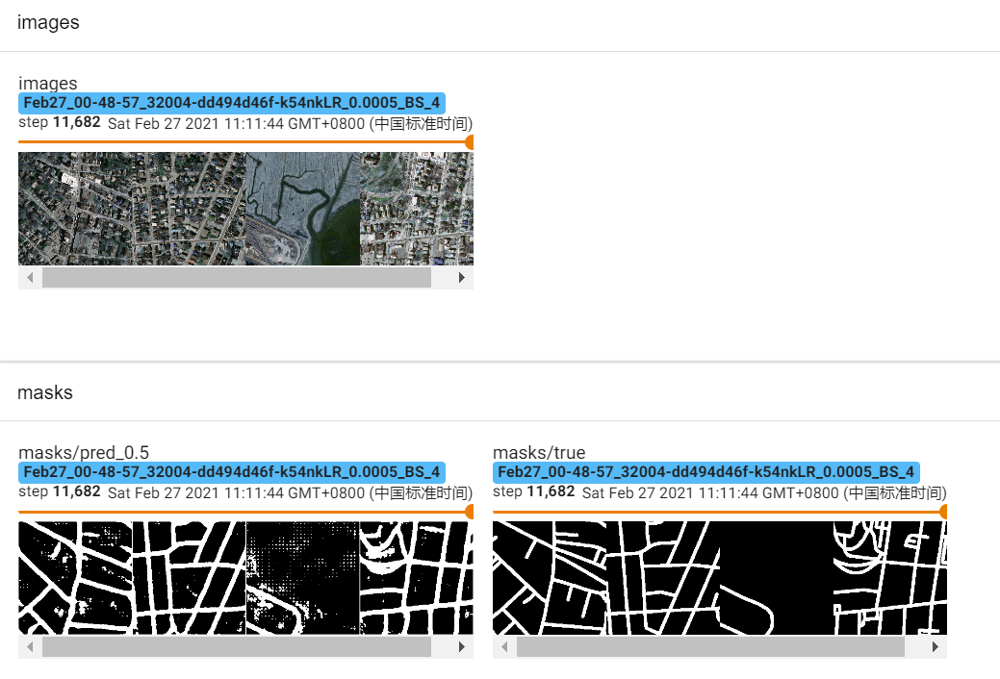
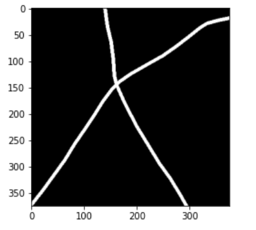
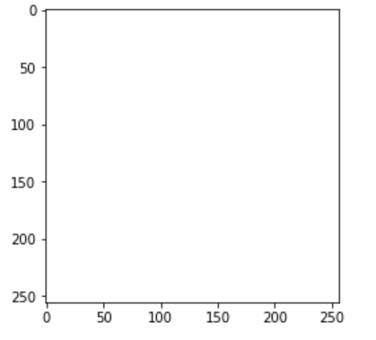
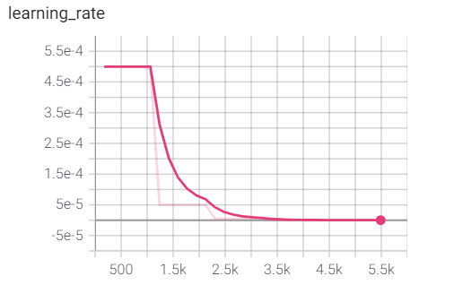

# 道路提取模型探索

> 现有文件结构
>
> solver.py：模型主要框架，训练，验证，优化器迭代等操作
>
> model.py：用到的模型（Unet，LinkNet34，D-LinkNet34）
>
> loss.py：损失函数
>
> data_loader.py：数据加载文件
>
> tester.py：测试结果
>
> 现有模型训练整体逻辑结构见 [2021-02-25_tmp.ipynb](2021-02-25_tmp.ipynb)，其他 `.ipynb` 在文件中自己定义模型结构等，部分操作已经弃用。

## 使用数据

massachusetts-roads-dataset 数据集中表现优良的部分数据，将图片切分为 16 部分，最终训练集共 441\*16 张图片，验证集（未经筛选）共 14\*16张图片，测试集（未经筛选）共 49\*16 张图片

## 当前代表性结果

- LinkNet 34 训练 20 个 epoch 结果

1. 已经可以提取出道路的主要部分，但是对于没有道路的地区，会提取出很多错误信息。
2. 优化器很重要，Adam 结果比较好

## 有效改动

1. 使用 LinkNet 系列，LinkNet 中 Encoder 部分是直接下载好的 ResNet，本就可以有效提取出一些特征
2. 使用 Adam 优化器比 SGD，RMSprop  效果更好

## 现有问题

1. 使用 LinkNet 得到的预测结果比实际 label 道路粗很多，不知为何

2. 现有模型对分布比较均匀的道路提取效果较好，而若图片有大片背景，模型会提取出很多白点，如何添加正则项改进？

3. 训练过程用 `nn.BCEWithLogitsLoss()`反向传播修正各个参数（不涉及阈值问题），验证过程用 `dice_loss`计算（大于阈值判为道路，小于阈值判为背景，阈值设置为 0.5），在测试时，使用 0.5 作为阈值却很难得到好结果，比如 LinkNet 某次实验中，真实标签，不同阈值预测结果分别如下

   

   阈值为 0.5 时全部预测为道路（但实际上 0.5 才是唯一出现在模型训练过程中的阈值（训练不涉及阈值，验证阈值为0.5））

   

阈值为 0.6 反而结果相对更合理

4. scheduler 的设置：当前学习率初始化为 0.0005，`scheduler = optim.lr_scheduler.ReduceLROnPlateau(optimizer, 'min', patience = 5)`，即在 5 次 `scheduler.step()`后网络参数都没有变化后学习率默认下降为原来的 0.1，但是实际训练中常出现下面问题：一旦学习率开始下降，就会减小参数变化幅度，从而更容易使学习率下降，最后模型难以继续学习

5. loss 基本在5 个 epoch 之后就没有大的变化了

